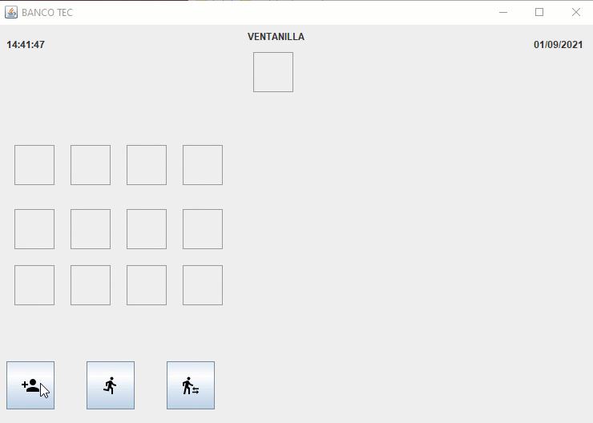

<h1 align="center">
    Simulación de Banco  🏦
</h1>
 

Simulación de atención en ventanilla bancaria. Se modela el flujo de clientes con tiempos de **llegada**, **atención** y **salida**, utilizando estructuras de datos para representar la cola de espera.

 

  

  

<h3 align="center">
    Ejecutable jar del proyecto
</h3>
 

   
  

  
Es el formato ejecutable estándar Java
  

> [!NOTE]
> Solo estoy organizando proyectos no modicare por el momento para optimizacion

  

# 🖥️ Proyectos Java - ISC

Colección de proyectos desarrollados en Java como parte de la materia **Sistemas Operativos** en la carrera de Ingeniería en Sistemas Computacionales. Cada proyecto simula distintos aspectos del funcionamiento de un sistema operativo, desde la gestión de procesos hasta la comunicación entre equipos en red.

     

# BUILD OUTPUT DESCRIPTION

When you build an Java application project that has a main class, the IDE
automatically copies all of the JAR
files on the projects classpath to your projects dist/lib folder. The IDE
also adds each of the JAR files to the Class-Path element in the application
JAR files manifest file (MANIFEST.MF).

To run the project from the command line, go to the dist folder and
type the following:

java -jar "Proyecto1BancoTec.jar"

To distribute this project, zip up the dist folder (including the lib folder)
and distribute the ZIP file.

Notes:

- If two JAR files on the project classpath have the same name, only the first
  JAR file is copied to the lib folder.
- Only JAR files are copied to the lib folder.
  If the classpath contains other types of files or folders, these files (folders)
  are not copied.
- If a library on the projects classpath also has a Class-Path element
  specified in the manifest,the content of the Class-Path element has to be on
  the projects runtime path.
- To set a main class in a standard Java project, right-click the project node
  in the Projects window and choose Properties. Then click Run and enter the
  class name in the Main Class field. Alternatively, you can manually type the
  class name in the manifest Main-Class element.

   
---

## 📚 Tecnologías y Conceptos Aplicados

- Lenguaje: **Java**
- Paradigmas: **Programación orientada a objetos**, **concurrencia**
- Conceptos de SO: **Gestión de procesos**, **memoria**, **sincronización**
- Herramientas: **Sockets**, **Threads**, **Estructuras de datos**

---

## 🚀 Autor  

Desarrollado por Luis Manuel Tapia como parte del curso de <strong>Sistemas Operativos</strong> en el Instituto Tecnológico de Celaya.

